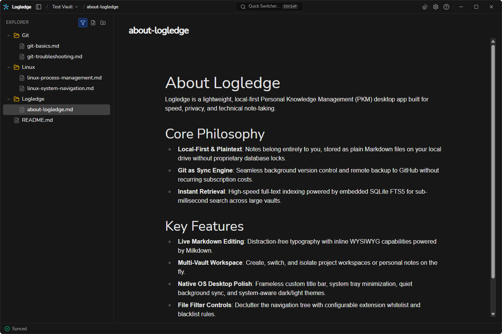

# Logledge

A desktop, local-first note-taking application based on plain `.md` files — synchronized across devices via GitHub. Built with [Wails v2](https://wails.io) (Go backend + React 19 / TypeScript frontend).

[](https://github.com/bs135/logledge/actions/workflows/ci.yml)
[](https://github.com/bs135/logledge/actions/workflows/release.yml)
[](LICENSE)



---

## Objectives

- **Data Sovereignty & Local-First**: Notes are stored directly as plain `.md` files in a local directory (Vault) on user disk. Free from proprietary formats, database lock-in, or mandatory cloud accounts. SQLite is used purely as an external secondary index for fast full-text search (FTS5).
- **Desktop Performance & Efficiency**: Designed with strict non-functional constraints: cold-start under 1s, idle RAM under 80MB, and portable binary size under 30MB.
- **Automated Git Synchronization**: Effortless two-way synchronization via GitHub without manual CLI commands, using OS Keychain for zero plaintext credential exposure.
- **Developer-Centric Writing Experience**: WYSIWYG Live Preview editing, syntax-highlighted code blocks, KaTeX math formulas, multi-vault support, custom themes, internationalization, and keyboard-driven workflows.

---

## Features

### Vault & File Explorer
- **Multi-Vault Management**: Open, switch between, edit, and manage multiple local vaults with custom display names and per-vault Git configurations.
- **Nested Directory Tree**: Arbitrarily deep folder hierarchies with expandable/collapsible nodes.
- **Drag-and-Drop Organization**: Move files and folders smoothly across the hierarchy.
- **Inline Creation & Renaming**: Create notes/folders and rename entries directly in the tree without modal interruptions.
- **File Type Filtering**: Configurable whitelist/blacklist filter modes (defaults to markdown notes: `.md`, `.markdown`, `.txt`) with quick toggle support.
- **Context Menus**: Context-aware menus on files, folders, and empty sidebar areas (New note, New folder, Rename, Delete).
- **Safe Deletion**: Moves items directly to the operating system's Recycle Bin / Trash via pure Go (`wastebasket`), preserving undo capabilities.
- **Resizable & Collapsible Sidebar**: Draggable resize handle (double-click to reset) and shortcut (`Ctrl+B`) to toggle visibility.
- **Real-Time Filesystem Watcher**: Two-way sync with external disk changes via `fsnotify` with debounce (300ms) and self-write suppression.

### Markdown WYSIWYG Live Preview Editor
- **Milkdown Crepe Live Preview**: Seamless WYSIWYG editing supporting CommonMark and GitHub Flavored Markdown (GFM: tables, task lists, strikethrough, link tooltips).
- **Code Syntax Highlighting**: Multi-language syntax highlighting powered by CodeMirror.
- **LaTeX / KaTeX Math Support**: Inline and block mathematical equation rendering (`$E=mc^2$`).
- **Sans-Serif Typography**: Clean, modern `Nunito` sans-serif typography across all headings and editor body.
- **Dedicated Inline Title Bar**: Synchronizes note filename with input on blur/Enter, with automatic sanitization of invalid OS characters.
- **Debounced Auto-Save**: Background auto-save (600ms debounce) with no manual `Ctrl+S` required.
- **Attachment Handling**: Paste images from clipboard or drag-and-drop into notes; saved automatically to `.attachments/` at the Vault root with relative markdown links.
- **Editor Context Menu**: Right-click menu for Cut, Copy, Paste, Select All, Undo, and Redo.
- **Remote Update Detection**: Alerts user when an active note is modified externally (via Git pull or external editor) with options to reload or preserve draft.

### Full-Text & Fuzzy Search
- **Quick Switcher (`Ctrl+P`)**: Instant fuzzy search by filename using `sahilm/fuzzy`.
- **Global Search (`Ctrl+Shift+F`)**: Full-text search across all notes in the vault using SQLite FTS5 (`modernc.org/sqlite`), displaying contextual snippets with highlighted search terms.
- **Background Indexing**: Incremental reindexing runs asynchronously in background goroutines without blocking cold-start or user typing.
- **Isolated Index Database**: SQLite index database is stored outside the Vault in the user's OS cache directory, preventing repo pollution.

### GitHub Sync Engine
- **Automated Background Sync**: Syncs automatically on application startup, every 5 minutes while active, and on clean application shutdown (with an 8-second safety timeout).
- **One-Click Manual Sync**: Immediate synchronization via status bar trigger or system tray menu.
- **System Git CLI Integration**: Invokes native `git` CLI via `os/exec` with silent background process creation on Windows (`CREATE_NO_WINDOW`, `HideWindow: true`).
- **Zero Plaintext Credentials**: Personal Access Tokens (PAT) are stored exclusively in the OS Keychain (Windows Credential Manager, macOS Keychain, Linux Secret Service via `zalando/go-keyring`). Also supports system SSH keys.
- **Non-Destructive Conflict Resolution**: Employs `git fetch` and `git merge --no-commit --no-ff -X ours`, detecting divergent changes and renaming conflicting local files to `<Name>.conflict.<timestamp>.md`. Never injects raw git conflict markers (`<<<<<<<`).
- **Real-Time Status Indicator**: Dynamic status bar showing Synced, Syncing, Conflict, Offline, or Error states.

### Desktop Shell & Ergonomics
- **Custom Frameless Title Bar**: Draggable header, active vault & note indicator, centered search trigger, and custom window controls (minimize, maximize/restore, close to tray).
- **System Tray Integration**: Runs in background with tray menu (Open Logledge, Sync Now, Quit) and single-instance lock to prevent duplicate processes.
- **Theming**: Full Dark, Light, and System Default theme support across the window shell, modals, and Milkdown Crepe editor.
- **Internationalization (i18n)**: Complete English (`en`) and Vietnamese (`vi`) localization across all UI elements, system tray, and dialogs.
- **Settings & Quick Help**: Comprehensive tabbed settings dialog and quick help modal with markdown syntax tips and keyboard shortcuts.

---

## Tech Stack

### Backend
- **Language**: Go 1.25+
- **Application Framework**: [Wails v2](https://wails.io) (`github.com/wailsapp/wails/v2`)
- **Database & Search**: `modernc.org/sqlite` (pure Go SQLite with FTS5 enabled, CGO-free)
- **Filesystem Watcher**: `github.com/fsnotify/fsnotify` (with debounce and self-write suppression)
- **Git Sync Engine**: System `git` CLI via `os/exec` (with OS-specific window suppression on Windows)
- **Credential Storage**: OS Keychain / Credential Manager via `github.com/zalando/go-keyring`
- **Trash / Recycle Bin**: `github.com/Bios-Marcel/wastebasket/v2` (pure Go)
- **Fuzzy Search**: `github.com/sahilm/fuzzy`
- **System Tray**: Windows Win32 API implementation via `golang.org/x/sys/windows`

### Frontend
- **Framework & Bundler**: React 19, TypeScript 5.6+, Vite 7
- **Styling**: Tailwind CSS v4 (`@tailwindcss/vite`), custom CSS dark/light theme variables, custom `Nunito` font
- **Markdown Editor**: Milkdown Crepe (`@milkdown/crepe`) with CodeMirror and KaTeX
- **Icons**: `lucide-react`
- **Internationalization**: Custom dictionary-based i18n (`en`, `vi`)

---

## Usage Guide

### Download & Install
Pre-built packages are published on [GitHub Releases](https://github.com/bs135/logledge/releases):

- **Windows**:
  - Installer: `logledge-windows-amd64-installer-v*.exe` (NSIS setup with WebView2 bootstrapper).
  - Portable: `logledge-windows-amd64-v*.exe` (standalone executable).
  - *Requirement*: Microsoft Edge WebView2 Runtime (preinstalled on Windows 10/11).
- **macOS**:
  - Universal Binary: `logledge-darwin-universal-v*.zip` (contains `Logledge.app` for both Apple Silicon and Intel).
- **Linux**:
  - Archive: `logledge-linux-amd64-v*.tar.gz` and standalone binary.
  - *Requirements*: GTK 3 (`libgtk-3-0`) and WebKit2GTK 4.1 (`libwebkit2gtk-4.1-0`).

> **Note**: System `git` CLI must be installed and available in your system `PATH` for GitHub synchronization features.

### Keyboard Shortcuts

| Shortcut | Context | Action |
|---|---|---|
| `Ctrl + P` | Global | Quick Switcher — fast fuzzy search to open notes |
| `Ctrl + Shift + F` | Global | Global Search — full-text search across all notes |
| `Ctrl + B` | Global | Toggle left sidebar visibility |
| `Ctrl + ,` | Global | Open Settings & Git Sync dialog |
| `F2` | File Tree | Rename selected file or folder inline |
| `Delete` | File Tree | Move selected file or folder to OS Recycle Bin / Trash |
| `Enter` / `Blur` | Note Title | Save inline note title and rename file |
| `Esc` | Modals / Menus | Close active modal, dropdown, or context menu |
| `Ctrl + Click Close (X)` | Title Bar | Force quit application (skips minimize to tray) |
| `Double-Click Handle` | Sidebar Resize | Reset sidebar width to default (256px) |
| `Right-Click` | File Tree / Sidebar | Open context menu (New note, New folder, Rename, Delete) |
| `Drag-and-Drop` | File Tree | Relocate file or folder into target folder |

*Note: All note edits are automatically saved to disk (debounced at ~600ms). There is no manual `Ctrl + S` required.*

---

## Development

### Prerequisites
- **Go**: 1.25 or higher
- **Node.js**: 20+ (Node 24 recommended) and npm
- **Wails CLI v2**:
  ```bash
  go install github.com/wailsapp/wails/v2/cmd/wails@latest
  ```
- **Git CLI**: Installed and available in `PATH`
- **Linux Packages** (Linux development only):
  ```bash
  sudo apt-get update && sudo apt-get install -y libgtk-3-dev libwebkit2gtk-4.1-dev
  ```

### Testing & verification

Backend verification:
```bash
go build ./...
go vet ./...
go test -v ./...
```

Frontend verification:
```bash
cd frontend
npm run build
```

### Run in development
```bash
wails dev
```
Starts the Wails development server with Vite hot-reloading (HMR) for frontend and automatic Go recompilation on backend changes.

### Building for Production

```bash
# Build standalone portable binary
wails build

# Build with NSIS installer (Windows)
wails build -nsis
```

Compiled binaries will be generated in `build/bin/`.

### Cross-Platform Packaging

Continuous Integration and packaging are automated via `.github/workflows/release.yml` using [Release-Please](https://github.com/googleapis/release-please) upon merges to `main` and tag pushes matching `v*`:

- **Windows (`windows-amd64`)**: Builds portable `.exe` and NSIS installer with WebView2 bootstrapper.
- **macOS (`darwin-universal`)**: Builds universal application bundle (`Logledge.app`) packaged into a `.zip` archive.
- **Linux (`linux-amd64`)**: Builds Linux binary with WebKit2GTK 4.1 tags packaged into a `.tar.gz` archive.

*Local packaging note*: Generating NSIS installers locally requires `makensis` (installable via Chocolatey: `choco install nsis -y`). On machines without administrative privileges, build the portable executable using `wails build`.

### Measured Non-Functional Requirements (Windows Dev Machine)

| Metric | Target | Measured | Architecture Highlights |
|---|---|---|---|
| Cold-start | < 1s | ~1.0s | Asynchronous non-blocking startup; Vault initialization, search indexing, and Git sync execute in background goroutines |
| Idle RAM | < 80MB | ~35–67MB | Native OS WebView2 via Wails instead of heavy bundled Chromium; memory footprint dominated by webview engine |
| Binary size (portable exe) | < 30MB | ~19.3MB | CGO-free pure Go SQLite (`modernc.org/sqlite`), tree-shaking, and asset compression via Go embed |

### GitHub Sync — Implementation Notes

- **System `git` CLI (`os/exec`)**: Leverages the user's native `git` CLI rather than pure Go Git implementations (such as `go-git`), ensuring full compatibility with advanced Git features, SSH configs, and credential helpers.
- **Windows Console Window Suppression**: Invokes Git commands with `CreationFlags = 0x08000000` (`CREATE_NO_WINDOW`) and `HideWindow = true` to eliminate unwanted console window flashing on Windows.
- **Conflict Handling without Conflict Markers**: Instead of inserting standard Git merge conflict markers (`<<<<<<<`, `=======`, `>>>>>>>`) that corrupt markdown rendering, the sync engine fetches remote changes and uses `git merge --no-commit --no-ff -X ours`. Files modified simultaneously on both local and remote are automatically backed up as `<Name>.conflict.<timestamp>.md`, allowing users to inspect both versions cleanly.
- **Zero Plaintext Credentials**: Personal Access Tokens (PAT) are stored exclusively in the native OS Keychain (Windows Credential Manager, macOS Keychain, Linux Secret Service via `zalando/go-keyring`). Tokens are never written to `.git/config`, environment variables, or disk files.

### Directory Structure

```
├── main.go                     # Entry point, Wails configuration, frameless window, single instance lock
├── app.go                      # Wails App struct: bridge between Go backend services and frontend
├── internal/
│   ├── config/                 # Application configuration (multi-vault, active vault, theme, language, filter)
│   ├── gitsync/                # Git sync engine, git CLI execution, credentials via go-keyring
│   ├── search/                 # SQLite FTS5 indexer, Quick Switcher fuzzy search, Global Search
│   ├── tray/                   # System tray integration and lifecycle
│   ├── vault/                  # VaultService: file/folder tree CRUD, attachments, trash
│   └── watcher/                # fsnotify wrapper with debounce and self-write suppression
├── frontend/
│   ├── src/
│   │   ├── components/         # TitleBar, FileTree, Editor, QuickSwitcher, GlobalSearch, Modals
│   │   ├── hooks/              # useVault, useTheme hooks
│   │   ├── i18n/               # Localization dictionaries (en, vi)
│   │   ├── App.tsx             # Main application layout and modal orchestration
│   │   ├── main.tsx            # React root mount
│   │   └── style.css           # Tailwind CSS imports, typography overrides, dark/light theme variables
│   └── wailsjs/                # Auto-generated Wails Go bindings (do not edit manually)
├── build/                      # Build assets, application icons, NSIS installer configs
├── docs/                       # Project documentation, plans, and assets
└── .github/workflows/          # CI, release, and automated testing workflows
```

---

## Contributing

Contributions, issues, and feature requests are welcome!

### Git Commit Convention
All commit messages must be written in **English** and follow this template:

```
type: commit title

 - commit body line 1
 - commit body line 2
```

Where `type` is one of: `feat`, `fix`, `refactor`, `perf`, `docs`, `style`, `test`, `chore`.

### Branching Model
- `main`: Production-ready release branch managed by Release-Please.
- `develop`: Active development and staging branch for pull requests.

---

## Acknowledgements

This project was developed with the assistance of AI.

---

## License

This project is licensed under the [MIT License](LICENSE).
